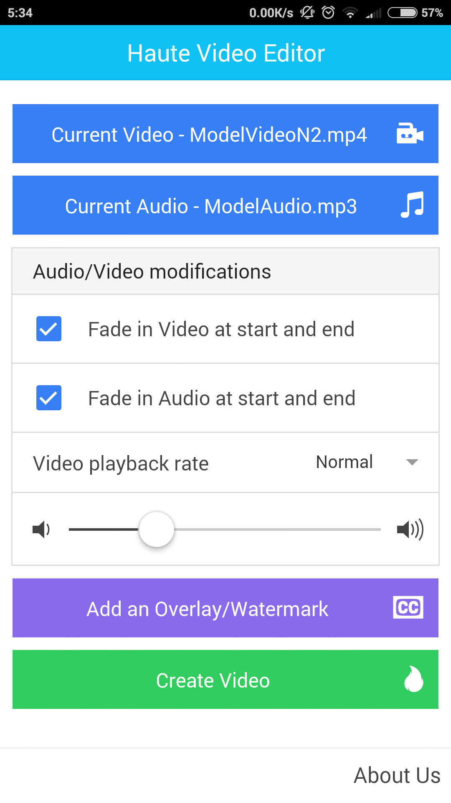

# RoposoVideoEditor
## About
This repository consists of a video editing tool built primarily for android on ionic platform. It performs basic tasks such as combining audio and video, fading of audio and video and speeding up of videos.
## Google Drive link to Files
You can find the APK, Sample Video and Sample Audio clips [here](https://drive.google.com/folderview?id=0B325xi9X7oeXa04zTWF0MGdzWG8&usp=sharing).

## Screenshots

## Simple HOW-TO
Choose an audio and video file by clicking the appropriate buttons and choose the filters you wish to apply
- 'Fade in Audio at start and end' causes the audio to fade as stated for 3 seconds at the start and end.
- 'Fade in Video at start and end' causes the video to fade as stated for 3 seconds at the start and end.
- 'Video playback rate' has three options to speed/slow down the video. The audio is also appropriately slowed.
- The volume control is present to control the target audio volume. The lowest value causes the target video to have 50% of the audio file's volume while max causes it to have 150% of it.

## Design
The application was designed to be done on a single screen as complex editing done on a mobile phone could be tedious work, even if the platform supported it. For simple video editing such as filters and adding audio, ffmpeg comes to mind. This project uses the android ffmpeg port. Since users who upload such videos are usually viners or say fashion designers who want to just showcase their recorded video with some music for aesthetics, it is beneficial for the app to be minimalistic. Thus the app was designed as a single page application.

## Known Bugs
The progress dialog is not persistent, so in case you click the progress indicator or outside it, it disappears. This however does not cause the current video creation to stop, it continues to to run in the background and you will be notified once it is complete.

## TODO
- [x] Add ffmpeg functionality to the app (finish up core features)
- [x] Upload apk and media files to a public server ex Google Drive
- [ ] Add Overlay Functionality
- [ ] Fix Progress indicator
- [x] Add screenshots of app to Git repo
- [ ] Add instructions on how to install app from source
- [x] Add basic desription on design choices taken to make the app (i.e why the app is fully completed on one screen over having multiple views).
